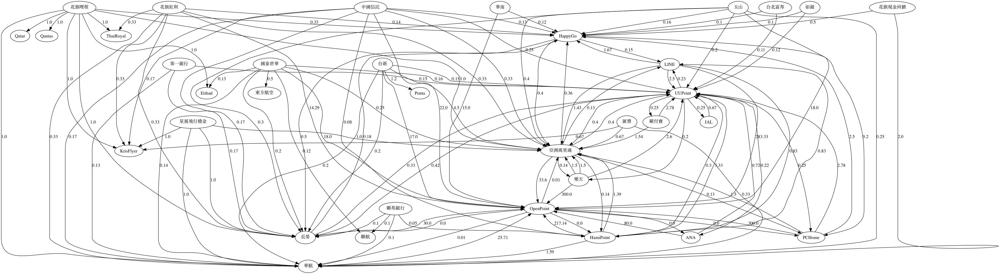

# 台灣紅利點數轉換一覽



計算台灣各種點數之間的最優交換比率(轉換路徑)。
計算是否有任何迴圈會造成無限增長點數？

# Install

```bash
brew install graphviz
```

# Usage

```bash
python points.py
```

# Reference

- HamiPoint 點數交換專區 https://www.cheerspoint.com.tw/trans_point_index.php
- LINE Points可以兌換成其他通路點數 http://official-blog.line.me/tw/archives/70132911.html
- 華南 http://card.hncb.com.tw/wps/portal/card/area2/bonus/Points
- HappyGo https://www.happygocard.com.tw/official/exchangearea/list.do
- 亞洲萬里通 https://www.asiamiles.com/zh/earn-miles/retail/detail.retail.ap.taiwan.html
- 亞洲萬里通 https://redeem.asiamiles.com/zh/gift-cards-and-miles-conversion/miles-conversion.html
- OpenPoint http://www.7-11.com.tw/openpoint_event1/15_exchange/index.html
- OpenPoint https://www.7-11.com.tw/openpoint_event1/15_exchange/airindex.html
- PCHome https://24h.pchome.com.tw/point-ex/p2o
- UUPoint https://uupon.tw/changePoint.do
- Ponta https://www.ponta.com.tw/ExchArea.action
- 中國信託 https://www.ctbcbank.com/html/long/creditcard/CNB2017010407/index.html
- 聯邦 https://card.ubot.com.tw/eCard/reward.aspx
- 歐付寶 https://www.opay.tw/Announcement/DetailAnnouncement?nID=1977
- 玉山 https://www.esunbank.com.tw/bank/personal/credit-card/reward/rebates/pointexchange
- 台新 https://www.taishinbank.com.tw/TS/TS02/TS0201/TS020104/TS02010404/
- 花旗 https://www.citibank.com.tw/global_docs/chi/cc/gr-mileage/index.html
- 第一銀行 https://card.firstbank.com.tw/card/chn/content/tw/activityArea/index2.html
- 國泰世華 https://www.cathaybk.com.tw/cathaybk/personal/credit-card/discount/bonus/point-exchange/
- 樂天 https://pointexchange.rakuten.com.tw/exchange/
- 星展 https://www.dbs.com.tw/personal-zh/cards/rewards/fly_redeem_mileage
- 匯豐 https://www.hsbc.com.tw/1/2/personal_zh_TW/hsbc-cards/rewards